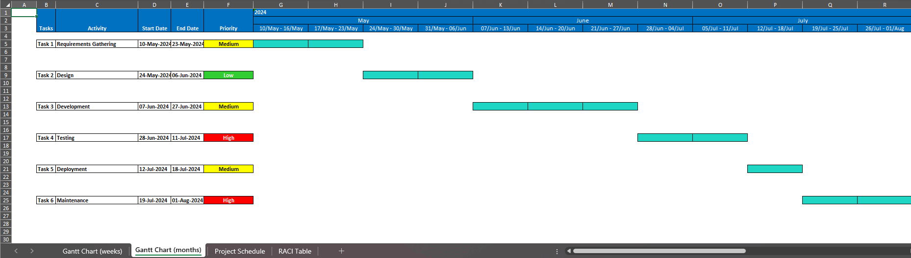
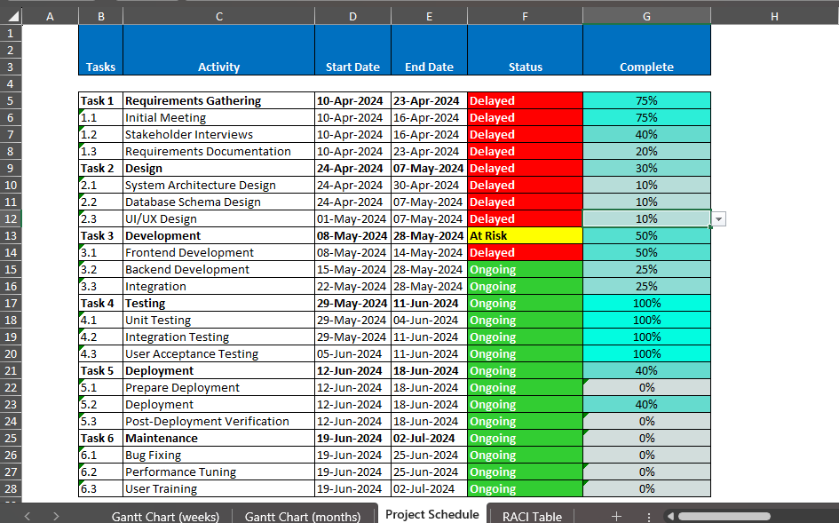
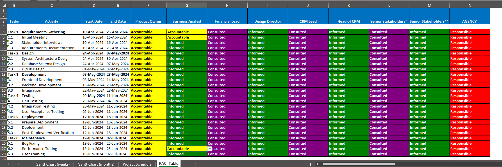
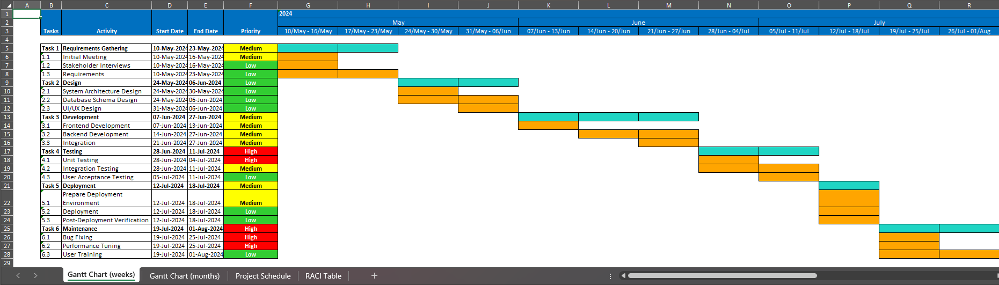
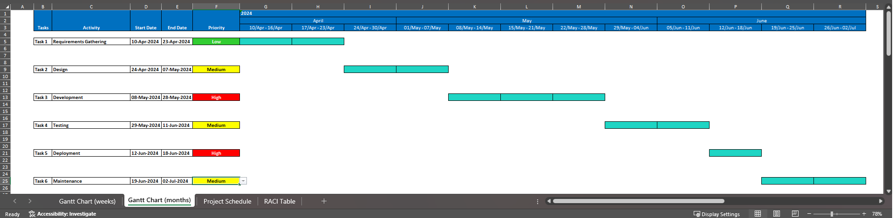
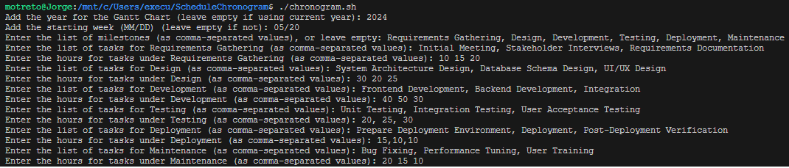

# Project Management Excel Tools (PMXT) 

Generates automatically a visual chronogram, project schedule and RACI Table automatically in Excel, mapping out Milestones and task with hours across workweeks to aid in project management.
- 
- 
- 

## Purpose

The Project Management Excel Tools (PMXT) serves as an automated solution for generating detailed gantt charts, project schedule and RACI table in Excel files, ideal for project managers and teams.

It simplifies the grouping of tasks throughout milestones on workweeks into simple, visual representations, making them easier to understand for stakeholders and essential for planning and tracking the progress of project proposals.

## Usage Instructions

1. **Prepare the Scripts**  
   Ensure that `chronogram.py` and `chronogram.sh` are both located in the same directory.

2. **Set Script Permissions**  
   Open a terminal and navigate to the directory containing the scripts. Give executable permissions to the shell script using the command:
   - `chmod +x chronogram.sh`

3. **Execute the Script**
   Run the script by typing the following command into the terminal:
   - `chronogram.sh`

4. **Provide Input Data**
   When prompted, provide the following inputs:

   Year for the Gantt Chart
   Enter the year for the Gantt Chart. If you leave this empty, the current year will be used.

      - Example: `2024`

   Starting Week Date
   Enter the starting week in MM/DD format. If you leave this empty, it will start from the first week of the year.

      - Example: `05/01`

   List of Milestones
   Enter the list of milestones as comma-separated values.

      - Example: `Requirements Gathering, Design, Development, Testing, Deployment, Maintenance`

   Tasks for Each Milestone
   For each milestone, enter the list of tasks as comma-separated values.

      - Example for "Requirements Gathering": `Initial Meeting, Stakeholder Interviews, Requirements Documentation`

   Hours for Tasks under Each Milestone
   For each milestone, enter the hours for each task as comma-separated values.

      - Example for "Requirements Gathering" tasks: `10, 15, 20`

  
5. **Access the Chronogram**
   After providing the input, the script will generate two files in the same directory:
- `chronogram.xlsx: An Excel file with the visual chronogram.`
- `chronogram.csv: A CSV file with the data used to generate the chronogram.`

6. **Open and view the Chronogram**
  Open the chronogram.xlsx file in Excel to view your visual chronogram with three sheets, Gantt Chart Weekly, Gantt Chart Monthly,Project Schedule and RACI Table.
  - 
      

      

      

      

      

## Prerequisites
### Python:
Please note that Python 3 must be installed on your system to use this script. If you do not have Python 3, please install it from the [official Python website](https://www.python.org/) or use your system's package manager.

### Python Libraries:
Before running this script, you must have the following Python libraries installed:
If you do not have Python 3, please install it from the official Python website or use your system's package manager.

- `pandas`
- `openpyxl`
- `re`
- `os`

You can install these libraries using pip with the following command:

- `pip install pandas`
- `pip install openpyxl`
- `pip install re`
- `pip install os`
