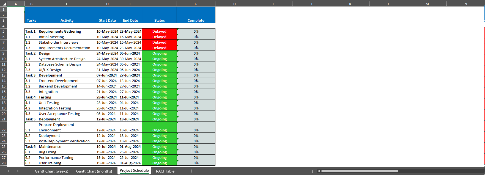

# Project Management Tools Generator (PMTG) 


Automatically generate Gantt Chart, Project Schedule and RACI Table sheets in Excel with simple inputs.

## Project Objective

The Project Management Tools Generator (PMTG) serves as an Automated Solution for generating detailed Gantt Charts, Project Schedules and RACI Tables sheets to an Excel file. Great for PMs during Project Proposals, and presentations to Stakeholders or Teams.

## Methods
- Data Input and Validation
- Automated Excel Sheet Generation
- Visualization of Gantt Charts and Schedules

   - **Generated Gantt Charts:**
   


   - **Generated Project Schedule and RACI Table:**
   


## Technologies
- `Python 3` 
- `Shell Scripting (Bash)`

  ### Python Libraries
   - `pandas`
   - `openpyxl`
   - `re`
   - `os`

## Project Description
The PMXTG script allows users to generate comprehensive project management tools in Excel format. By providing inputs such as milestones, tasks, and hours, users can create detailed Gantt charts, Project Schedules, and RACI tables that help in effective project planning and tracking. The tool is designed to streamline the process of project documentation, making it accessible for project managers to create professional documents quickly.

## Steps

1. **Prepare the Scripts:**  
   Ensure that `chronogram.py` and `chronogram.sh` files are both located in the same directory.

2. **Set Script Permissions:**  
   Open a terminal and navigate to the directory containing the scripts. Give executable permissions to the shell script using the command:
   - `chmod +x chronogram.sh`

3. **Execute the Script:**  
   Run the script by typing the following command into the terminal:
   - `./chronogram.sh`

4. **Provide Input Data:**  
   When prompted, provide the following inputs:

   4.1 **Year for the Gantt Chart:**  
        Enter the year for the Gantt Chart. If you leave this empty, the current year will be used.
   
        - **Prompt:** Add the year for the Gantt Chart (leave empty if using current year)
        - **Example:** `2024`
      
   4.2 **Starting Week Date:**  
        Enter the starting week in MM/DD format. If you leave this empty, it will show Month and Week counters.
   
        - **Prompt:** Add the starting week (MM/DD) (leave empty if not)
        - **Example:** `05/01`
            
   4.3 **Priorities for Tasks:**  
        Use Yes or No option if you would like to enable Priorities for each Task.
   
        - **Prompt:** Do you want to add priorities for the tasks? (yes or no)
        - **Example:** `Yes`
      
   4.4 **List of Milestones:**  
        Enter the list of milestones as comma-separated values.
   
        - **Prompt:** Enter the list of milestones (as comma-separated values), or leave empty
        - **Example:** `Requirements Gathering, Design, Development, Testing, Deployment, Maintenance`
      
   4.5 **Tasks for Each Milestone:**  
        For each milestone, enter the list of tasks as comma-separated values.
   
        - **Prompt:** Enter the list of tasks for Current Milestone (as comma-separated values)
        - **Example for "Requirements Gathering":** `Initial Meeting, Stakeholder Interviews, Requirements Documentation`
      
   4.6 **List of Hours for Tasks:**  
        For each milestone, enter the hours for each task as comma-separated values, using integers or floats.
   
        - **Prompt:** Enter the hours for tasks under Current Milestone (as comma-separated values)
        - **Example for "Requirements Gathering" tasks:** `10, 15, 20`
            
   4.7 **List of Priorities for Tasks:**  
        If you enabled Priorities, then for each milestone, enter priorities for each task as comma-separated values, using the options: Low, Medium, High.
   
        - **Prompt:** Enter the priority for tasks under Current Milestone (Low, Medium, High) (as comma-separated values)
        - **Example for "Requirements Gathering":** `Medium, Low, Low`

   4.8 **Names for the Roles Representatives in the RACI Table:**  
        Use Yes or No option if you would like to enable Priorities for each Task.
   
        - **Prompt:** Do you want to add the names for the roles in the RACI Table? (yes or no)
        - **Example:** `Yes`

   4.9 **Add Names for each Role Representative:**  
        Fill the name of the current representative for each role to populate the RACI Table.
   
        - **Prompt:** Enter the name for Product Owner
        - **Example:** `John Smith`
        - **Prompt:** Enter the name for Financial Lead
        - **Example:** `Emily Davis`
        - **Prompt:** Enter the name for AGENCY
        - **Example:** `Creative Solutions Inc.`

6. **Access the Generated Excel File with the Project Management Tool Sheets:**  
   After providing the input, the script will generate two files in the same directory:
   - `chronogram.xlsx`: An Excel file with the Gantt Chart, Project Proposal, and RACI Table sheets.
   - `chronogram.csv`: A CSV file with the data used to generate the Gantt Chart.

7. **Open and View the Chronogram:**  
   Open the `chronogram.xlsx` file in Excel to view your visual chronogram with three sheets: Gantt Chart Weekly, Gantt Chart Monthly, Project Schedule, and RACI Table.

   - **Generated Gantt Chart Weekly:**
   - 

   - **Generated Gantt Chart Monthly:**
   - 

   - **Generated Project Schedule:**
   - 

   - **Generated RACI Table:**
   - 

## Sample Input

```bash
motreto@Jorge:/mnt/c/Users/execu/ScheduleChronogram$ ./chronogram.sh
Add the year for the Gantt Chart (leave empty if using current year):
Input: 2024

Add the starting week (MM/DD) (leave empty if not):
Input: 05/10

Do you want to add priorities for the tasks? (yes or no): Yes

Enter the list of milestones (as comma-separated values), or leave empty:
Input: Requirements Gathering, Design, Development, Testing, Deployment, Maintenance

Adding tasks for Milestone: Requirements Gathering
Enter the list of tasks for Requirements Gathering (as comma-separated values):
Input: Initial Meeting, Stakeholder Interviews, Requirements Documentation

Enter the hours for tasks under Requirements Gathering (as comma-separated values):
Input: 10, 15, 20

Enter the priority for tasks under Requirements Gathering (Low, Medium, High) (as comma-separated values):
Input: Medium, Low, Low

Adding tasks for Milestone: Design
Enter the list of tasks for Design (as comma-separated values):
Input: System Architecture Design, Database Schema Design, UI/UX Design

Enter the hours for tasks under Design (as comma-separated values):
Input: 30, 20, 25

Enter the priority for tasks under Design (Low, Medium, High) (as comma-separated values):
Input: Low, Low, Low

Adding tasks for Milestone: Development
Enter the list of tasks for Development (as comma-separated values):
Input: Frontend Development, Backend Development, Integration

Enter the hours for tasks under Development (as comma-separated values):
Input: 40, 50, 30

Enter the priority for tasks under Development (Low, Medium, High) (as comma-separated values):
Input: Medium, Medium, Medium

Adding tasks for Milestone: Deployment
Enter the list of tasks for Deployment (as comma-separated values):
Input: Prepare Deployment Environment, Deployment, Post-Deployment Verification

Enter the hours for tasks under Deployment (as comma-separated values):
Input: 15, 10, 10

Enter the priority for tasks under Deployment (Low, Medium, High) (as comma-separated values):
Input: Medium, Low, Low

Adding tasks for Milestone: Maintenance
Enter the list of tasks for Maintenance (as comma-separated values):
Input: Bug Fixing, Performance Tuning, User Training

Enter the hours for tasks under Maintenance (as comma-separated values):
Input: 20, 15, 10

Enter the priority for tasks under Maintenance (Low, Medium, High) (as comma-separated values):
Input: High, High, Low

Do you want to add the names for the roles in the RACI Table? (yes or no): Yes
Enter the name for Product Owner: John Smith
Enter the name for Business Analyst: Jane Doe
Enter the name for Financial Lead: Emily Davis
Enter the name for Design Director: Michael Brown
Enter the name for CRM Lead: Olivia Johnson
Enter the name for Head of CRM: Liam Williams
Enter the name for Senior Stakeholder*: Sophia Martinez
Enter the name for Senior Stakeholder**: William Garcia
Enter the name for AGENCY: Creative Solutions Inc.
```

## Conclusion
The PMXTG provides an efficient and user-friendly approach to creating essential project management documents. By automating the generation of Gantt Charts, Project Schedules, and RACI Tables, it saves time and reduces the potential for errors. This tool enables project managers to easily visualize and organize their project tasks, timelines, and responsibilities, making it an invaluable asset for effective project management and successful project delivery.

## Contact

- [LinkedIn](https://www.linkedin.com/in/jlopezgonzalez/)
- [GitHub](https://github.com/JLopez662)
- [GitLab](https://gitlab.com/jorge.lopez19)

<p align="center">
  <a href="https://www.linkedin.com/in/jlopezgonzalez/">
    
  </a>
  <a href="https://github.com/JLopez662">
    
  </a>
  <a href="https://gitlab.com/jorge.lopez19">
    
  </a>
</p>
